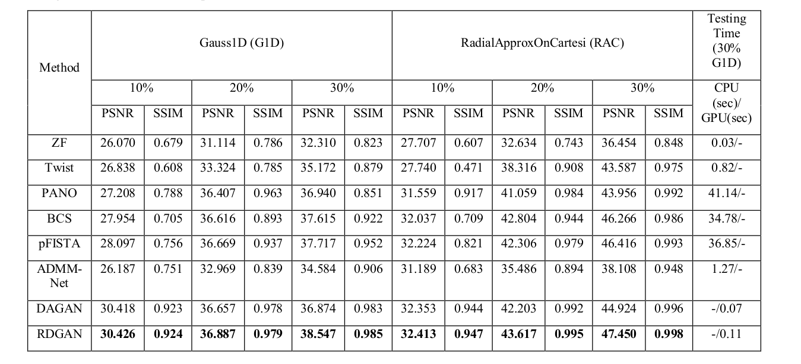
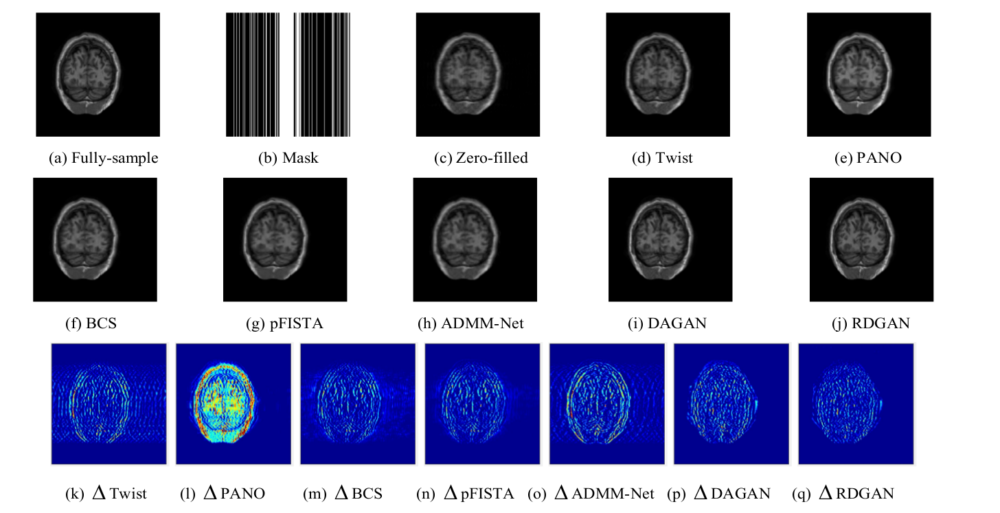

# RDGAN

:fire: RDGAN (Adversarial Training and Dilated Convolutions for Compressed Sensing MR , published in 2019) implemented (Unet on single GPU) in Tensorflow 1.8+. This is an official implementation. :fire:

This is the official implementation code for [Adversarial Training and Dilated Convolutions for Compressed Sensing MRI](https://www.spiedigitallibrary.org/conference-proceedings-of-spie/11179/111793T/Adversarial-training-and-dilated-convolutions-for--compressed-sensing-MRI/10.1117/12.2539623.short?SSO=1)

If you use this code for your research, please cite our paper.

```
@article{xu2019adversarial,
title={Adversarial training and dilated convolutions for compressed sensing MRI},
author={Xu, Chao and Tao, Jinxu and Ye, Zhongfu and Xu, Jinzhang and Kainat, Wajiha},
year={2019}}
    
```

If you have any questions about this code, please feel free to contact Chao Xu (chaoxu006@gmail.com).

# Prerequisites

The original code is in python 3.6 under the following dependencies:
1. tensorflow (v1.8.0)
2. tensorlayer (v1.9.0)
3. easydict (v1.6)
4. nibabel (v2.2.1)
5. scikit-image (v0.19.2)
6. numpy (v1.15.4)

Code tested in Ubuntu 16.04 with Nvidia GPU + CUDA CuDNN (whose version is compatible to tensorflow v1.8.0).

# How to use

1. Prepare data

    1) Data used in this work are publicly available from the MICCAI 2013 grand challenge ([link](https://my.vanderbilt.edu/masi/workshops/)). We refer users to register with the grand challenge organisers to be able to download the data.
    2) Download training and test data respectively into data/MICCAI13_SegChallenge/Training_100 and data/MICCAI13_SegChallenge/Testing_100 (We randomly included 100 T1-weighted MRI datasets for training and 50 datasets for testing)
    3) run 'python data_loader.py'
    4) after running the code, training/validation/testing data should be saved to 'data/MICCAI13_SegChallenge/' in pickle format.

2. Download pretrained VGG19 model

    1) Download 'vgg19.npy' from [this link](https://github.com/machrisaa/tensorflow-vgg)
    2) Save 'vgg19.npy' into 'trained_model/VGG19'
    
3. Train model
    1) run 
    ``` CUDA_VISIBLE_DEVICES=0 python train.py --model 'unet_refine' --mask 'gaussian1d' --      maskperc 30 --lossfunciton  'gan_loss'  --penalty 'no_penalty' --train 'train' ```
    
    where you should specify model, mask, maskperc, lossfunction, penalty, train,  respectively:
    - model: choose from 'unet' or 'unet_refine'
    - mask: choose from 'radialcartesi', 'gaussian1d', 'gaussian2d'
    - maskperc: choose from '10', '20', '30', '40', '50' (percentage of mask)
    - lossfunciton: choose from 'gan_loss', 'wgan_loss, 'lsgan_loss'
    - penalty: choose from 'no_penalty', 'wgangp_penalty', 'dragan_penalty'
    - train: choose from 'train','evaluate'
 
4. Test trained model
    1) the trained model parameters in 'checkpoints/', image which you want to reconstruct in  
    'evaluate/samples/'
    2) run 
    ``` CUDA_VISIBLE_DEVICES=0 python train.py --model 'unet_refine' --mask 'gaussian1d' --maskperc 30  --train 'evaluate' ```
     where you should specify model, mask, maskperc, train respectively (as above).

# Results

:: Results from this reporepository. ::




Please refer to the paper for the other detailed results.

### What we are doing and going to do

- [x] WGAN
- [x] WGAN-GP
- [x] LSGAN
- [x] VGG19
- [ ] SNGAN
- [ ] MultiGPU

## References
:hamburger:

Thanks for these source codes porviding me with knowledges to complete this repository.

- https://github.com/nebulaV/DAGAN
    - nebulaV/DAGAN
- https://github.com/machrisaa/tensorflow-vgg
    - machrisaa/tensorflow-vgg
- https://github.com/changwoolee/WGAN-GP-tensorflow
    - changwoolee/WGAN-GP-tensorflow
- https://github.com/GunhoChoi/LSGAN-TF
   - GunhoChoi/LSGAN-TF
- https://github.com/nnUyi/SNGAN
   - nnUyi/SNGAN
